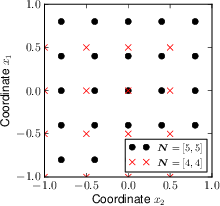

Users guide
===========

Installation
------------

There is no special installation required. It can be downloaded from https://github.com/vondrejc/FFTHomPy.git or using Git by::

    git clone https://github.com/vondrejc/FFTHomPy.git

However, the software requires numerical libraries:
    * `numpy <http://www.numpy.org/>`_
    * `scipy <http://www.scipy.org/>`_

Running the program
-------------------

Command line usage::

    $ python main.py examples/scalar/scalar_2d.py

or only as::

    $ ./main.py examples/scalar/scalar_2d.py

where ``examples/scalar/scalar_2d.py`` is an input file for *FFTHomPY*.

Definition of input file
------------------------

Input file for *FFTHomPy* consists of material definition and problem definition.

Material definition
^^^^^^^^^^^^^^^^^^^
Material coefficients can be defined as matrix-inclusion composites or grid-based composites.

.. _matrix-inclusions:

Matrix-inclusions composites
""""""""""""""""""""""""""""

In this case, material is expressed at points :math:`\Vx` of periodic cell :math:`\puc=\prod_{i=1}^d (-\frac{Y_i}{2},\frac{Y_i}{2})` as

.. math::
    \TA(\Vx) &= \sum_{i=1}^n f\incl{i} (\Vx-\Vx\incl{i}) \TA\incl{i}

where functions :math:`f\incl{i}` describe inclusion topologies located at :math:`\Vx\incl{i}` with material coefficients :math:`\TA\incl{i}\in\xRdd`.
An example of material coefficients is named ``'square'``
::

    import numpy as np

    materials = {'square': {'Y': np.ones(dim),
                            'inclusions': ['square', 'otherwise'],
                            'positions': [np.zeros(dim), ''],
                            'params': [0.6*np.ones(dim), ''],
                            'vals': [11*np.eye(dim), 1.*np.eye(dim)]}}

and the used keywords have following meanings:

    - ``'Y'``: ``numpy.array`` of shape ``(dim,)`` describes the size of periodic cell :math:`\puc` in dimension ``dim``
    - ``'inclusions'``: list of inclusions :math:`f\incl{i}` of following types
        * ``'square'``, ``'circle'``, and ``'otherwise'`` in two-dimensional settings
        * ``'cube'``, ``'ball'``, and ``'otherwise'`` in two-dimensional settings
    - ``'positions'``: list of positions :math:`\Vx\incl{i}` corresponding to individual inclusions
        * the position corresponds to center of gravity with respect to coordinate system; the inclusion ``'otherwise'`` has no position because it represents the area in periodic cell omitted by inclusions
    - ``'params'``: list of parameters determining the inclusions
        * for ``'square'`` and ``'cube'``, it corresponds to sizes of individual sides
        * for ``'circle'`` and ``'ball'``, it corresponds to diameter
    - ``'vals'``: list of material coefficients for individual inclusions; coefficients are represented as ``numpy.array`` of shape corresponding to physical problem according to problem definition; for scalar elliptic problem, the shape is ``(dim, dim)`` while for linearized elasticity the shape is ``(D, D)`` where ``D = dim*(dim+1)/2``.

Grid-based composites
"""""""""""""""""""""
Contrary to :ref:`matrix-inclusions`, grid-based composites are defined on grid points:

.. math::
    \xPk
    =
    \sum_{\alp} \frac{Y_{\alp}k_{\alp}}{P_{\alp}}
    \cb{\alp}\quad
    \text{for } 
    \Vk \in \ZPd = 
  \biggl\{ \Vk \in \set{Z}^d : 
    -\frac{P_\alpha}{2} \leq k_\alpha < \frac{P_\alpha}{2} \biggr\}

for some number of points :math:`\VP\in\xNd` and the size :math:`\VY\in\xRd` of periodic cell :math:`\puc=\prod_{i=1}^d (-\frac{Y_i}{2},\frac{Y_i}{2})\subset\xRd`; examples for odd and even grids are depicted in following figure

for periodic cell :math:`\puc=\prod_{i=1}^d (-1,1)` with the cell size :math:`\VY=(2,2)`.

The material is then approximated with the following formula

.. math::
    \TA(\Vx) &=
    \sum_{\Vk\in \set{Z}^d_{\VP}} \psi(\Vx-\Vx^{\Vk}_{\VP}) \TA(\Vx_{\VP}^{\Vk})
    \quad\text{for }\VP\in\xNd \text{ and } \Vx\in\puc
    :label: grid-based_composite

where function :math:`\psi:\puc\rightarrow\xRd` is taken either by

.. math::
    \rect_{\Vh}(\Vx) &=
    \begin{cases}
    1
    &
    \text{if }
    |x_\alp| < \frac{h_\alp}{2}\text{ for all }\alp
    \\
    0
    &
    \text{otherwise}
    \end{cases}
    \quad\text{for }\Vh=\left(\frac{Y_\alp}{P_\alp}\right)_{\alp=1}^d
    :label: constant_approx
    
leading to piece-wise constant approximation of material coefficients, or by

.. math::
    \tri_{\Vh}(\Vx) &= \prod_{\alp}\max\{1-|\frac{x_\alp}{h_\alp}|,0\}
    \quad\text{for }\Vh=\left(\frac{Y_\alp}{P_\alp}\right)_{\alp=1}^d
    :label: bilinear_approx

leading to piece-wise bilinear approximation of material coefficients.

In comparison to :ref:`matrix-inclusions`, the material coefficients definition
::

    materials.update({'square_Ga': {'Y': np.ones(dim),
                                    'inclusions': ['square', 'otherwise'],
                                    'positions': [np.zeros(dim), ''],
                                    'params': [0.6*np.ones(dim), ''],
                                    'vals': [11*np.eye(dim), 1.*np.eye(dim)],
                                    'order': 0,
                                    'P': 5*np.array(dim)}})

contains two additional parameters: 
    - ``'P'``: ``numpy.array`` of shape ``(dim,)`` describes the resolution of approximation in :eq:`grid-based_composite`
    - ``'order'``: define approximation order:
        * ``0``: constant approximation according to :eq:`constant_approx`
        * ``1``: bilinear approximation according to :eq:`bilinear_approx`.

Problem definition
^^^^^^^^^^^^^^^^^^
Here, the example of problem description is stated:
::

    problems = [{'name': 'prob1',
                 'physics': 'scalar',
                 'material': 'square',
                 'solve': {'kind': 'GaNi',
                           'N': N,
                           'primaldual': ['primal', 'dual']},
                 'postprocess': [{'kind': 'GaNi'},
                                 {'kind': 'Ga',
                                  'order': None},
                                 {'kind': 'Ga',
                                  'order': 0,
                                  'P': N},
                                 {'kind': 'Ga',
                                  'order': 1,
                                  'P': 27*N}],
                 'solver': {'kind': 'CG',
                            'tol': 1e-6,
                            'maxiter': 1e3}}]

The individual keywords are explained:
    - ``'name'``: the name of a problem
    - ``'physics'``: defines the physical problem that is solved; following alternatives are implemented:
        * ``'scalar'``: scalar linear elliptic problem (diffusion, stationary heat transfer, or electric conductivity)
        * ``'elasticity'``: linearized elasticity (small strain)
    - ``'material'``: keyword refering to dictionary ``materials`` or directly dictionary defining the material coefficients
    - ``'solve'``: defines the problem discretization, the way how to solve minizers (corrector functions)
        * ``'kind'``: is either ``'Ga'`` (Galerkin approximation) or ``'GaNi'`` (Galerkin approximation with numerical integration); it thus corresponds to the discretizaiton way
        * ``'N'``: is a ``numpy.array`` defining the approximation order of trigonometric polynomials; the higher the value is, the better approximation is provided
        * ``'primaldual'``: determine if primal, dual, or both formulations are calculated
    - ``'solver'``: defines the linear solver and relating parameters
        * ``'kind'``: linear solver one of ``'CG'`` for Conjugate gradients,  ``'BiCG'`` for Biconjugate gradients, ``'richardson'`` for Richardson's iterative solution, ``'scipy_cg'`` for ``scipy.sparse.linalg.cg``, and ``'scipy_bicg'`` for ``scipy.sparse.linalg.bicg``,
        * ``'tol'``: the required tolerance (float) for the convergence of linear solver
        * ``'maxit'``: the maximal number of iterations
    - ``'postprocess'``: defines the way for calculating homogenized material coefficients from minimizers that are obtained with a way defined in ``'solver'``
        * ``'kind'``: is either ``'Ga'`` (Galerkin approximation) or ``'GaNi'`` (Galerkin approximation with numerical integration); it thus corresponds to the discretizaiton way
        * ``'order'``: applicable only for ``'Ga'``, it defines approximation order according to :eq:`constant_approx` or :eq:`bilinear_approx`
        * ``'P'``: applicable only for ``'Ga'``, this ``numpy.array`` of shape ``(dim,)`` describes the resolution of approximation in :eq:`grid-based_composite`

